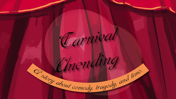
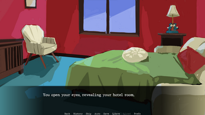
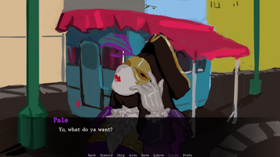
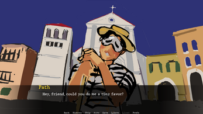

# Carnival_Unending
--------
Game submission for the narrative driven jam #12 2023

<i>
You are a tourist, visiting Venice during the Carnevale. 

The Carnevale is a celebration that happens before Lent and culminates in Martedi Grasso (Mardi Gras/Fat Tuesday). 
While trying to have a normal vacation, you find yourself at the center of a love story... or a comedy... or a tragedy... you can't quite tell to be honest.
</i>

Credits:
--------
Designed and Written by Anthony Maiolo (Spacesong13)

Programming and Implementation by Hugo Fanchini "Hugosh"

Character and Background Art by Walther (waltherp28.business@gmail.com)

Audio and Music by Aditya Gojamgunde "adigoj"

How to play
--------
- Go to the game page on itch.io : [Carnival-Unending](https://spacesong13.itch.io/carnival-unending)
- Download the .zip matching your OS
- Unzip and launch the application called "Carnival Unending"
- Enjoy !

Screenshots
--------

